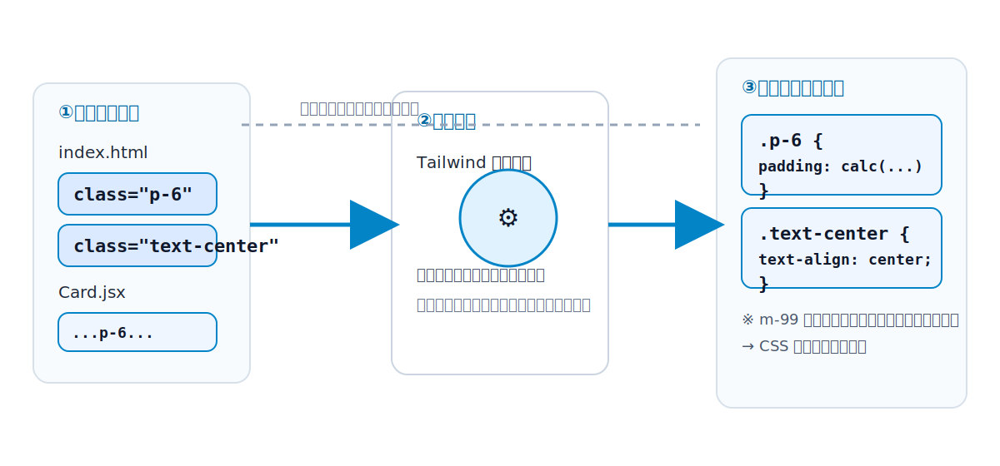
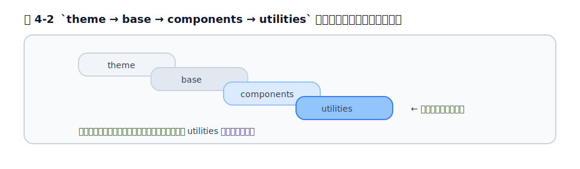

# 第4章 Tailwind CSS はどう動くのか

## 4.1 全体像 — テンプレート走査 → 必要なクラスのみ CSS 生成

まず全体像をつかみましょう。Tailwind の動作は、驚くほどシンプルな 1 つの流れに集約できます。

1. あなたが書いた HTML・ERB・JSX などの**ソースファイルを走査（スキャン）する**
2. その中に登場する**クラス名らしき文字列**を拾い集める
3. 拾ったクラスに対応する **CSS を、必要な分だけ生成する**

ここで決定的に重要なのは、**「使われているクラスだけを生成する」**という点です。Tailwind には理論上、数十万通りのクラスが存在しえます（色 × 余白 × バリアントの組み合わせ）。しかし、それらをすべて出力するわけではありません。あなたのコードに `p-6` が登場して初めて、`.p-6 { padding: calc(var(--spacing) * 6); }` という CSS が生成されます（この `calc(...)` という形の意味は [§4.9](chapter4.md#49-生成-css-を実際に覗いてみる)・[第5章](chapter5.md)で扱います。ここでは「使ったものだけ生成される」ことに注目してください）。登場しないクラスの CSS は、最初から作られません。

この「使うものだけ作る」という発想が、第1部で触れた「CSS が線形に増えない」性質と、本番ビルドが小さい理由を支えています。

<figure>

<figcaption>図 4-1　Tailwind はソースを走査し、実際に使われているクラスだけを CSS に生成する（JIT）。</figcaption>
</figure>

## 4.2 JIT（Just-In-Time）の考え方

この「使われているクラスだけを、その場で生成する」方式を **JIT（Just-In-Time、必要なときに）** と呼びます。

[第2章](../part1/chapter2.md)で歴史を見たとおり、初期の Tailwind は逆の発想でした。**あらかじめ考えられる全クラスを生成しておき**、本番ビルド時に PurgeCSS で使っていないものを削る、という二段構えです。これには、開発時の CSS が数 MB に膨らむ、ビルドが遅い、削除設定を間違えると本番でスタイルが消える、といった問題がありました。

JIT はこれを反転させました。「全部作って削る」のではなく、「**使うものだけ最初から作る**」。2021 年にプレビュー公開され、v3.0 で既定の動作になったこの仕組みにより、

- 開発時から CSS が小さい
- ビルドが速い
- 開発環境と本番環境で生成される CSS が完全に一致する（PurgeCSS による「削り忘れ・削りすぎ」が起きない）
- `top-[-113px]` のような任意の値も、その場で生成できる

という利点が得られました。現在の Tailwind（v4）は、この JIT の考え方を前提に動いています。

## 4.3 v4 の新エンジン（Oxide / Lightning CSS）と高速化

v4 では、この JIT を実行するエンジンそのものが刷新されました。コードネーム **Oxide** と呼ばれる新エンジンです（出典は[第29章](../part8/chapter29.md)および本章の参考資料）。

ポイントは 2 つです。

- **パフォーマンスを重視した実装**: 性能が重要な部分は Rust で実装されています。公式（v4.0 時点）の計測では、フルビルドが約 3.8 倍、増分ビルド（差分だけの再ビルド）が約 8 倍以上速くなり、変更がない場合の再ビルドはマイクロ秒単位で完了するとされています。
- **Lightning CSS の採用**: CSS のパース（解析）、ベンダープレフィックスの付与、`@import` の解決、圧縮（minify）などを、Rust 製の高速ツール Lightning CSS がまとめて担当します。これにより、以前は別途必要だった `postcss-import` や `autoprefixer` といったツールが、Tailwind 単体に取り込まれました。

開発者にとっての実感は「とにかく速い」ことと「**周辺ツールの設定が減った**」ことです。v4 で導入が簡単になった背景には、このエンジンの刷新があります。

## 4.4 自動コンテンツ検出（v4）と `@source` / 旧 `content` 配列の違い

4.1 で「ソースファイルを走査する」と述べました。では Tailwind は、**どのファイルを走査すればよいと知る**のでしょうか。ここは v3 と v4 で大きく変わった点です。

**v3 まで**は、設定ファイルに「走査対象」を手で書く必要がありました。

```js
// tailwind.config.js（v3 の書き方）
module.exports = {
  content: [
    './app/views/**/*.html.erb',
    './app/javascript/**/*.js',
  ],
};
```

この `content` 配列の指定を忘れたり、パスを間違えたりすると、「クラスが効かない」という典型的なトラブルが起きました。

**v4** では、この指定が原則**不要**になりました（自動コンテンツ検出）。Tailwind はプロジェクト内のファイルを自動的に走査対象とします。このとき、

- `.gitignore` に書かれたファイルは除外する
- `node_modules`・バイナリファイル・CSS ファイル・ロックファイルは除外する

といった賢い既定値を持っています。つまり「ビルド対象になりそうなテキストファイル」を自動で見つけてくれます。

それでも明示的に指定したい場合（自動検出から外れた場所のテンプレートや、外部パッケージ内のクラスを拾いたい場合）には、CSS 側で **`@source` ディレクティブ**を使います。

```css
@import "tailwindcss";

/* 自動検出に加えて、このパスも走査対象にする */
@source "../node_modules/my-ui-library";
```

逆に特定パスを除外したいときは `@source not "..."`、自動検出を完全に止めたいときは `source(none)` を使います。**v3 の `content` 配列が「CSS 側の `@source` と自動検出」に置き換わった**、と理解しておけば十分です。

## 4.5 `@import "tailwindcss"` が展開するもの

v4 で Tailwind を読み込む CSS は、たった 1 行です。

```css
@import "tailwindcss";
```

この 1 行が、内部的にいくつかの部品を読み込んでいます。中身を分解すると、おおよそ次の 4 つのレイヤーに対応しています。

- **theme**: テーマ変数（色・余白などのデザイントークン）の定義。`:root` に CSS 変数として並びます（[第5章](chapter5.md)）。
- **base**: ブラウザ間の差異をならす土台のスタイル（Preflight と呼ばれるリセット CSS）。たとえば見出しの余白を消す、などの初期化です。
- **components**: コンポーネント向けのレイヤー（自分で書くクラスの置き場所として用意されている）。
- **utilities**: `p-6` や `text-center` などのユーティリティクラス本体。

この順番には意味があります。後で説明する CSS Cascade Layers（`@layer`）の仕組みにより、**utilities は base より優先される**ように設計されています。だから、Preflight がデフォルトで付けたスタイルを、ユーティリティで上書きできるのです。

必要に応じて、この 1 行を分割して特定のレイヤーだけ読み込むこともできますが、通常は `@import "tailwindcss";` の 1 行で問題ありません。

## 4.6 CSS Cascade Layers（`@layer`）と詳細度の制御

[第1章](../part1/chapter1.md)で、CSS の大きな悩みの 1 つは「詳細度の戦い」だと述べました。`.btn` と `#main .btn` がぶつかると、詳細度の高い後者が勝つ——この予測しづらさです。

v4 の Tailwind は、これを **CSS Cascade Layers（カスケードレイヤー）** という比較的新しい CSS の標準機能で制御しています。これは `@layer` を使って「レイヤーの優先順位」をあらかじめ宣言できる仕組みです。

```css
/* 概念図: レイヤーの順番を先に決める */
@layer theme, base, components, utilities;
```

このように宣言すると、**後ろのレイヤーが前のレイヤーに勝ちます**。しかも重要なのは、**レイヤー間の優先順位は詳細度より強い**という点です。つまり、`utilities` レイヤーにあるユーティリティは、詳細度が低くても、`base` レイヤーのスタイルに確実に勝てます。

ただし、これが保証されるのは **Tailwind が生成するレイヤー（theme / base / components / utilities）の内側**での話です。あなたがレイヤーの外に書いた素の CSS や、`!important` を付けたスタイルは、この優先順位の枠組みの外で評価されるため、ユーティリティに勝つことがあります。「Tailwind のレイヤー内では詳細度の戦いから解放される」と理解してください。

これによって、Tailwind は「ユーティリティは常に意図どおり効く」状態を、詳細度の小細工なしに実現しています。[第1章](../part1/chapter1.md)で見た「`!important` を付けないと効かない」といった戦いから解放されるのは、この仕組みのおかげです（なお、どうしても強制したいときのための `!` important 記法は別に用意されています。4.8 参照）。

<figure>

<figcaption>図 4-2　`theme → base → components → utilities` の順で重なり、後ろが勝つ。</figcaption>
</figure>

## 4.7 任意の値（arbitrary value）が動的に解決される仕組み

「`top-[-113px]` や `grid-cols-15` のような、定義した覚えのない値がなぜ効くのか」。これは多くの人が最初に驚くところです。

Tailwind は、クラス名を**パターンとして解釈**します。たとえば `p-{数値}` というパターンを理解していて、`p-6` を見れば `padding` の値をスケールから計算し、`p-[13px]` のように角かっこで**任意の値**が書かれていれば、その値をそのまま使った CSS を生成します。

```html
<div class="top-[-113px] grid grid-cols-[1fr_500px_2fr]">...</div>
```

```css
/* 生成される CSS（簡略化） */
.top-\[-113px\] { top: -113px; }
.grid-cols-\[1fr_500px_2fr\] {
  grid-template-columns: 1fr 500px 2fr;
}
```

v4 では、この「動的な解決」がさらに広がりました。たとえば `grid-cols-15` のように、スケールに明示的に用意されていない値でも、規則的に生成できるものは設定なしで使えます。

ただし、この仕組みには**重要な前提**があります。Tailwind は 4.1 で見たとおり、ソースを**ただのテキストとして走査**して、登場した文字列を拾っているだけです。つまり、コード上に**完全なクラス名の文字列として存在していなければ、生成されません**。たとえば `text-${color}` のようにクラス名を動的に組み立てると、Tailwind はそれを 1 つの文字列として認識できず、CSS が生成されません。この「動的なクラス名の落とし穴」は、実務で頻発する代表的なつまずきなので、[第27章](../part7/chapter27.md)のアンチパターンで詳しく扱います。

## 4.8 スタイル衝突の解決（後勝ち・`!` important・prefix）

ユーティリティを並べていると、相反するクラスが同時に付くことがあります。たとえば `p-4` と `p-8` を両方書いたら、どちらが勝つのでしょうか。

**(1) 後勝ち（ソース順）**

ここで注意したいのは、**HTML の `class` 属性に書いた順番では決まらない**ことです。勝敗を決めるのは、**生成された CSS の中での順番**です。同じプロパティを扱うユーティリティ同士では、CSS で後に来るルールが勝ちます。

```html
<!-- class の順番を入れ替えても結果は同じ。CSS 上の順序で決まる -->
<div class="p-8 p-4">...</div>
```

そのため「同じ要素に競合するユーティリティを 2 つ書く」のは避け、条件によって**どちらか一方だけが付く**ように組むのが基本です（このための道具が[第23章](../part6/chapter23.md)の `tailwind-merge` です）。

**(2) `!` important 修飾子**

どうしても優先したいときは、クラスの末尾に `!` を付けると `!important` が付与されます。

```html
<div class="bg-red-500!">必ず赤</div>
```

ただし `!important` の多用は、[第1章](../part1/chapter1.md)で見た「詳細度の戦い」を再び招きます。最終手段と考えてください。

**(3) prefix（プレフィックス）**

既存の CSS やサードパーティのスタイルとクラス名が衝突する環境では、すべてのユーティリティに接頭辞を付けて名前空間を分けられます。たとえば接頭辞を `tw` にすると `tw:flex` のように書きます。既存システムへ段階的に Tailwind を導入するときに役立ちます（[第8章](../part3/chapter8.md)・[第26章](../part7/chapter26.md)）。

## 4.9 生成 CSS を実際に覗いてみる

仕組みを腹落ちさせる一番の方法は、**実際に生成された CSS を見る**ことです。手元で確認するなら、最小の入力 CSS を用意してビルドします。

入力（`input.css`）:

```css
@import "tailwindcss";
```

テンプレート（`index.html`）に `p-6` と `text-center` だけを使ったとします。すると、出力 CSS には Preflight（base）とテーマ変数（theme）に加えて、おおよそ次のようなユーティリティだけが含まれます（実際の出力は簡略化しています）。

```css
.p-6 { padding: calc(var(--spacing) * 6); }
.text-center { text-align: center; }
```

ここで `p-6` が `1.5rem` という固定値ではなく `calc(var(--spacing) * 6)` になっている点に注目してください。これは v4 が、余白を**テーマ変数 `--spacing` を基準に動的計算している**ことを示しています。この「テーマ変数」こそが次の[第5章](chapter5.md)の主役です。

> ヒント: 細かいセットアップなしに生成結果を試したいときは、公式の **Tailwind Play**（<https://play.tailwindcss.com/>）が便利です。左に HTML、右に結果が出て、生成 CSS も確認できます。

## 参考資料

* [Tailwind CSS Docs — Styling with utility classes（衝突解決・important・prefix）](https://tailwindcss.com/docs/styling-with-utility-classes)
* [Tailwind CSS Docs — Detecting classes in source files（自動検出・@source）](https://tailwindcss.com/docs/detecting-classes-in-source-files)
* [Tailwind CSS Docs — Functions and directives（@import など）](https://tailwindcss.com/docs/functions-and-directives)
* [Tailwind CSS v4.0（新エンジン・Lightning CSS）](https://tailwindcss.com/blog/tailwindcss-v4)
* [「Open-sourcing our progress on Tailwind CSS v4.0」（新エンジン Oxide の出典, 2024-03-06）](https://tailwindcss.com/blog/tailwindcss-v4-alpha)
* [Tailwind Play（生成結果の確認）](https://play.tailwindcss.com/)

