# 第5章 テーマシステム

[第4章](chapter4.md)の最後で、`p-6` が `calc(var(--spacing) * 6)` という CSS 変数を使った値になることを見ました。この章では、その `--spacing` をはじめとする**テーマ（デザイントークン）**の仕組みを掘り下げます。v4 で最も大きく変わった部分であり、Tailwind を「自分のプロジェクトの色や余白に合わせて使う」ための心臓部です。

## 5.1 テーマとは何か（デザイントークンの一元管理）

[第3章](../part1/chapter3.md)で、Tailwind の強みは「制約のあるデザイン」だと述べました。`blue-500` や `p-4` のように、選べる値があらかじめ決まっているからこそ、見た目が揃う、という話です。

この「選べる値の一覧」を定義しているのが**テーマ**です。色・余白・フォントサイズ・ブレークポイント・角丸・影など、デザイン上の決め事をすべて値の一覧として持っています。こうした「デザイン上の決め事を値として定義したもの」を **デザイントークン**と呼びます。

テーマを一元管理することの意味は大きいものです。「ブランドカラーを少し変えたい」と思ったとき、テーマの定義を 1 か所直せば、それを使っているすべてのユーティリティに反映されます。デザインシステムの「単一の真実（Single Source of Truth）」になるわけです。

## 5.2 `@theme` ディレクティブの基本（v4）

v4 では、テーマを **CSS ファイルの中**に `@theme` ディレクティブで書きます。これが「CSS ファースト設定」と呼ばれる、v4 の目玉の変更です。

```css
@import "tailwindcss";

@theme {
  --color-mint-500: oklch(0.72 0.11 178);
  --font-display: "Satoshi", sans-serif;
  --breakpoint-3xl: 120rem;
}
```

たったこれだけで、`bg-mint-500`・`text-mint-500`、`font-display`、`3xl:` といった**新しいユーティリティやバリアントが使えるようになります**。

この変更の意味を、第1部の流れで押さえておきましょう。

**v3 まで**は、設定を JavaScript ファイル（`tailwind.config.js`）に書いていました。

```js
// tailwind.config.js（v3 の書き方）
module.exports = {
  theme: {
    extend: {
      colors: { mint: { 500: '#19c39c' } },
    },
  },
};
```

CSS のためのデザイントークンを、わざわざ JavaScript で定義していたわけです。v4 はこれを「CSS のことは CSS で書く」という自然な形に戻しました（5.6 で移行を扱います）。

## 5.3 テーマ変数が「CSS 変数 ＋ ユーティリティ生成」を兼ねる仕組み

ここが v4 のテーマシステムで最も重要な発想です。`@theme` に書いた変数は、**2 つの役割を同時に果たします**。

1. **本物の CSS 変数になる**: `@theme` の中身は、出力 CSS の `:root` にそのまま CSS カスタムプロパティとして並びます。だから、Tailwind を通さず素の CSS や JavaScript からも参照できます。
2. **ユーティリティクラスを生成する指示にもなる**: 同時に Tailwind に対して「この変数に対応するユーティリティを作れ」と指示します。

公式ドキュメントの言葉を借りれば、「**テーマ変数は単なる CSS 変数ではなく、新しいユーティリティクラスを作るよう Tailwind に指示するものでもある**」のです。

```css
@theme {
  --color-mint-500: oklch(0.72 0.11 178);
}
```

この 1 行から、次の両方が生まれます。

```css
/* 1. CSS 変数として :root に出力される */
:root {
  --color-mint-500: oklch(0.72 0.11 178);
}
/* 2. ユーティリティが生成される（簡略化） */
.bg-mint-500 { background-color: var(--color-mint-500); }
.text-mint-500 { color: var(--color-mint-500); }
```

だから、HTML ではユーティリティとして使えますし、

```html
<div class="bg-mint-500">...</div>
```

ユーティリティでは表現しづらい場面では、同じ値を CSS 変数として直接使えます。

```html
<div style="background-color: var(--color-mint-500)">...</div>
```

**「クラスでも変数でも、同じ 1 つの定義から使える」**——これが v4 のテーマが強力な理由です。

<figure>

<figcaption>図 5-1　`@theme` に書いた1つの変数が、CSS 変数とユーティリティクラスの両方を生み出す。</figcaption>
</figure>

## 5.4 名前空間と生成されるクラスの対応

`@theme` の変数は、適当な名前を付けるわけではありません。**変数名の接頭辞（名前空間）が、どんなユーティリティを生成するかを決めます**。主な対応は次のとおりです。

| 変数の名前空間 | 生成されるもの | 例 |
| --- | --- | --- |
| `--color-*` | 色のユーティリティ | `bg-*` `text-*` `border-*` `fill-*` |
| `--spacing-*`（基準は `--spacing`） | 余白・サイズ | `p-*` `m-*` `gap-*` `w-*` |
| `--breakpoint-*` | レスポンシブのバリアント | `sm:` `md:` `lg:` |
| `--font-*` | フォントファミリ | `font-*` |
| `--text-*` | フォントサイズ | `text-sm` `text-lg` |
| `--radius-*` | 角丸 | `rounded-*` |
| `--shadow-*` | 影 | `shadow-*` |
| `--animate-*` | アニメーション | `animate-*` |

つまり、`--color-brand: #1e40af;` と書けば自動的に `bg-brand` や `text-brand` が使えるようになり、`--breakpoint-tablet: 50rem;` と書けば `tablet:` というレスポンシブのバリアントが使える、というように、**名前空間さえ合わせればユーティリティが生える**わけです。この規則性を知っておくと、テーマの拡張が一気に分かりやすくなります。

## 5.5 拡張・上書き・リセット

テーマのカスタマイズには 3 つのパターンがあります。

**(1) 拡張（既定値に追加する）**

デフォルトのパレットやスケールを残したまま、新しい値を足します。`@theme` に新しい変数を書くだけです。

```css
@theme {
  --color-brand: oklch(0.45 0.24 264); /* 既存の色 + brand を追加 */
}
```

**(2) 上書き（既定値を置き換える）**

同じ名前の変数を再定義すると、その値だけ差し替わります。

```css
@theme {
  --breakpoint-lg: 70rem; /* lg の値を変更 */
}
```

**(3) リセット（既定値を捨てて作り直す）**

ある名前空間を一度まっさらにしたいときは、その名前空間に対して `初期化したい接頭辞-*: initial` を指定してから定義し直します。たとえば「デフォルトの色をすべて捨て、自社パレットだけにする」なら `--color-*: initial` です。

```css
@theme {
  --color-*: initial;        /* 色の名前空間だけをすべて消す */
  --color-bg: oklch(1 0 0);  /* 自社の色だけ定義 */
  --color-fg: oklch(0.2 0 0);
}
```

なお、名前空間を限定せずに `--*: initial` と書くと、色だけでなく**すべてのテーマ変数（余白・フォント・ブレークポイントなど）が一括でリセット**されます。色だけ作り直したいときに `--*: initial` を使うと、余白やブレークポイントまで消えてしまうので注意してください。名前空間単位なら `--color-*: initial`、全体リセットなら `--*: initial`、と使い分けます。

リセットは強力ですが、`gray-500` のような便利な既定色も消える点に注意してください。多くのプロジェクトでは「拡張」か「一部上書き」で十分です。

## 5.6 v3 の `tailwind.config.js` との対応関係と移行

v3 から来た人のために、対応関係を整理します。考え方は「`theme.extend` の中身を、CSS 変数の名前空間に置き換える」です。

```js
// v3: tailwind.config.js
module.exports = {
  theme: {
    extend: {
      colors: { brand: '#1e40af' },
      spacing: { '128': '32rem' },
      screens: { '3xl': '1920px' },
    },
  },
};
```

```css
/* v4: CSS の @theme */
@theme {
  --color-brand: #1e40af;
  --spacing-128: 32rem;
  --breakpoint-3xl: 120rem;
}
```

なお、既存の `tailwind.config.js` を v4 でもそのまま読み込みたい場合は、CSS 側で `@config "../tailwind.config.js";` と書けば互換モードで動きます。大きな既存プロジェクトを少しずつ移行するときの逃げ道として用意されています（移行全体は[第29章](../part8/chapter29.md)）。

## 5.7 spacing スケールと `--spacing` の動的計算（v4）

[第4章](chapter4.md)で見た `p-6 → calc(var(--spacing) * 6)` を、ここで回収します。

v3 までは、`p-1`・`p-2`・`p-3`… といった余白の値が、一つひとつ個別に定義されていました（`p-1` は `0.25rem`、`p-2` は `0.5rem`…）。v4 では、これを **1 つの基準値 `--spacing` からの掛け算**で表現します。

```css
@theme {
  --spacing: 0.25rem; /* 基準値。既定は 0.25rem（= 4px） */
}
```

この基準があると、`p-6` は `calc(var(--spacing) * 6)`、`m-2` は `calc(var(--spacing) * 2)` というように、**任意の倍数を動的に計算**できます。だから、わざわざ定義していない `p-13` のような値も規則的に生成できますし、基準値を変えれば全体の余白感を一括で調整できます。第1部で「余白は `--spacing` を基準にした段階的な値」と表現したのは、この仕組みのことです。

## 5.8 色: oklch ベースの新パレットと P3

v4 のデフォルトの色パレットは、従来の 16 進数（`#3b82f6`）ではなく **oklch** という色空間で定義されています。

```css
--color-red-500: oklch(63.7% 0.237 25.331);
```

なぜ oklch なのでしょうか。理由は 2 つあります。

- **知覚的に均等**: oklch は「人間の目で見た明るさ・鮮やかさ」に近い形で色を表現します。`500` → `600` → `700` と数字が上がるにつれて、見た目の暗さが素直に変化します。これは色のスケールを作るうえで扱いやすい性質です。
- **より広い色域（P3）を表現できる**: 16 進数（sRGB）では表現できない、より鮮やかな色を、対応するディスプレイで表示できます。新しい広色域ディスプレイの能力を活かせます。

実務上は「oklch という新しい書き方になった」程度の認識で問題ありませんが、自分でブランドカラーを定義するときも oklch で書くと、明度のステップを揃えやすくなります（色の詳細は[第12章](../part4/chapter12.md)）。

## 5.9 実行時に CSS 変数を使う

5.3 で見たとおり、テーマ変数は本物の CSS 変数として出力されます。これは実務で地味に効いてきます。

- **素の CSS との連携**: ユーティリティで書きにくい複雑なスタイルを CSS で書くとき、`var(--color-brand)` でテーマの色を参照できます。色の定義が二重管理になりません。
- **JavaScript からの参照**: 実行時に `getComputedStyle(document.documentElement).getPropertyValue('--color-brand')` のように、テーマの値を JavaScript から読めます。チャートライブラリに Tailwind の色を渡す、といった用途で便利です。
- **動的なテーマ切り替え**: CSS 変数なので、`.dark` クラスが付いたときに変数の値を差し替える、といったことも自然にできます（ダークモードは[第18章](../part5/chapter18.md)）。

「デザイントークンが、Tailwind の中だけに閉じず、プロジェクト全体で使える共通言語になる」——これが v4 のテーマシステムが目指したゴールです。

## 参考資料

* [Tailwind CSS Docs — Theme variables（@theme・名前空間・拡張/上書き/リセット）](https://tailwindcss.com/docs/theme)
* [Tailwind CSS Docs — Colors（oklch パレット）](https://tailwindcss.com/docs/colors)
* [Tailwind CSS Docs — Functions and directives（--spacing()・theme() ほか）](https://tailwindcss.com/docs/functions-and-directives)
* [Tailwind CSS v4.0（CSS-first config・theme variables）](https://tailwindcss.com/blog/tailwindcss-v4)

