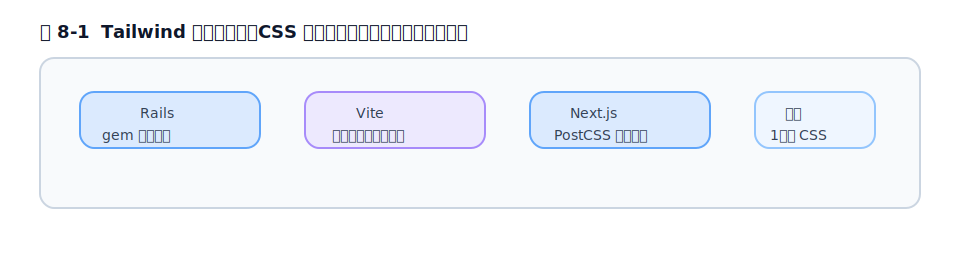

# 第8章 フレームワークごとの導入

## 8.1 導入差が生まれる理由

[第7章](chapter7.md)で「導入経路は土台によって変わる」と述べました。その理由をはっきりさせておきましょう。

Tailwind がやることは、突き詰めれば「CSS をビルドして 1 枚のスタイルシートを出力する」ことです。問題は、**そのビルドを誰が回すか**がフレームワークごとに違う、という点です。

- React・Vue・Svelte などは、たいてい **Vite** がビルドを回します → Vite プラグイン経路（[第7章](chapter7.md)）。
- Next.js は内部で **PostCSS** を使います → PostCSS プラグイン経路。
- Rails は **独自のアセットパイプライン**（Propshaft など）を持っています → Rails 専用の gem 経路。

つまり「Tailwind の入れ方の違い」は、ほとんど「そのフレームワークが CSS をどうビルドするかの違い」です。この視点を持つと、以下の各手順がなぜそうなっているのか腑に落ちます。それでは、本書が最重点とする Rails から詳しく見ていきます。

<figure>

<figcaption>図 8-1　フレームワークごとの導入差は、CSS を誰がビルドするかの違い。</figcaption>
</figure>

## 8.2 Rails 詳説 ①: `tailwindcss-rails` gem と最短セットアップ

Rails で Tailwind を使う最も標準的な方法は、**`tailwindcss-rails`** という gem を使うことです。これは Tailwind Labs ではなく Rails チームがメンテナンスしている公式 gem で、Tailwind 公式の Rails ガイドからもこの gem が案内されています。

最大の特徴は、**Node.js を必要としない**ことです。`tailwindcss-rails` は `tailwindcss-ruby` gem を通じて、Tailwind の**スタンドアロン実行ファイル**（単体で動く CLI のバイナリ）を取得して使います。そのため、`npm` も `package.json` も `node_modules` も要りません。Rails らしく、Ruby の世界だけで完結します。これが、[第7章](chapter7.md)で見た JavaScript 系の経路と決定的に違う点です。

セットアップは、新規 Rails アプリなら次の手順です（Rails 8 以降を前提とします）。

```bash
# 新規アプリを作る
rails new my-project
cd my-project

# gem を追加して、インストールタスクを実行する
bundle add tailwindcss-rails
./bin/rails tailwindcss:install
```

`tailwindcss:install` を実行すると、必要なファイルが自動で用意されます。具体的には、入力 CSS（後述の `app/assets/tailwind/application.css`）が作られ、レイアウトで生成済み CSS を読み込めるように読み込み設定が必要に応じて整えられ（既定レイアウトにすでに読み込みがある場合はそのまま使われます）、開発用の `Procfile.dev` などが用意されます。

> 新規作成の段階で決めるなら、`rails new my-project --css tailwind` のように `--css tailwind` を付けると、最初から Tailwind 入りのアプリが作られます。

## 8.3 Rails 詳説 ②: 入力 CSS・出力・ウォッチ（bin/dev）の関係

ここが Rails 利用者が最も混乱しやすいところなので、「**入力 → ビルド → 出力 → 読み込み**」の流れとして整理します。

**入力 CSS の場所**

あなたが Tailwind の設定やカスタムスタイルを書くファイルは、ここです。

```
app/assets/tailwind/application.css
```

中身は v4 の作法どおり、`@import "tailwindcss";` から始まります。

```css
@import "tailwindcss";

@theme {
  --color-brand: oklch(0.45 0.24 264);
}
```

> v3 を知っている人へ: このファイルの場所は **v4 で変わりました**。v3（gem の v3 系）では `app/assets/stylesheets/application.tailwind.css` でしたが、v4 では `app/assets/tailwind/application.css` です。古い記事のパスのままだと動かないので注意してください。

**ビルドと出力**

`tailwindcss-rails` は、上の入力 CSS を読んで、生成済みの CSS を `app/assets/builds/` に出力します。Rails のアセットパイプライン（Propshaft）は、その出力済み CSS を配信します。ビルドを手動で 1 回だけ実行したいときは次のコマンドです。

```bash
./bin/rails tailwindcss:build
```

**ウォッチ（開発中の自動再ビルド）**

開発中は、CSS を書き換えるたびに手でビルドするのは現実的ではありません。そこで「ファイルの変更を監視して自動で再ビルドする」ウォッチを使います。方法は主に 3 つあります。

1. **`bin/dev`（最も一般的）**: Rails サーバーと Tailwind のウォッチを**同時に**起動してくれるコマンドです。内部では `Procfile.dev` に書かれた複数プロセス（Web サーバー＋ `tailwindcss:watch`）を Foreman などでまとめて動かしています。開発時はこれを使うのが基本です。

   ```bash
   ./bin/dev
   ```

2. **`tailwindcss:watch` を単体で動かす**: ウォッチだけを別プロセスで動かしたいときに使います。

   ```bash
   ./bin/rails tailwindcss:watch
   ```

3. **Puma プラグインで `rails server` に統合する**: `bin/dev` を使わず、`rails server` の起動に合わせてウォッチを走らせる構成も用意されています。

整理すると、**「`app/assets/tailwind/application.css` に書く → `bin/dev` が変更を監視して `app/assets/builds/` に出力 → Propshaft がそれを配信する」**という一本道です。この流れさえ押さえれば、Rails での Tailwind は迷いません。

## 8.4 Rails 詳説 ③: Propshaft / Sprockets と cssbundling 経路の使い分け

Rails には CSS の扱い方が複数あり、ここも混乱の元なので関係を整理します。

**アセットパイプライン: Propshaft と Sprockets**

アセットパイプラインは「CSS や画像などの静的ファイルを配信する仕組み」です。Rails 8 以降の既定は **Propshaft** という軽量な仕組みで、古くからの **Sprockets** に代わるものです。`tailwindcss-rails` はどちらとも組み合わせて動きますが、新規プロジェクトでは Propshaft が標準だと考えてよいでしょう。重要なのは、**Tailwind 自体のビルドは gem（スタンドアロン実行ファイル）が行い、その成果物をアセットパイプラインが配信する**、という分担関係です。

**もう 1 つの選択肢: `cssbundling-rails`**

`tailwindcss-rails` とは別に、**`cssbundling-rails`** という gem を使う道もあります。これは **Node.js と `package.json` を使い**、Tailwind・PostCSS・Dart Sass・Bootstrap・Bulma といった CSS 処理を `yarn build:css` で実行して、`app/assets/builds/application.css` に出力する方式です（JavaScript のバンドルを担う `jsbundling-rails` とは別物で、こちらは CSS 専用です）。

両者の使い分けの目安は次のとおりです。

| | `tailwindcss-rails` | `cssbundling-rails` |
| --- | --- | --- |
| Node.js / package.json | **不要** | 必要 |
| 仕組み | スタンドアロン実行ファイル | `yarn build:css` で CSS を処理 |
| 向いているケース | Tailwind だけ使えればよい。構成をシンプルにしたい | すでに Node ベースの JS ビルドがあり、CSS も同じ流れに乗せたい |

**多くの Rails プロジェクトでは、Node 不要でシンプルな `tailwindcss-rails` が第一候補**です。フロントエンドを JavaScript ツールで本格的にバンドルしている場合に限り、`cssbundling-rails` を検討する、という順序がおすすめです。

## 8.5 Rails 詳説 ④: importmap 構成での注意点と Turbo との相性

最後に、JavaScript の管理方式である **importmap** との関係です。

ここで誤解を解いておきます。**importmap は JavaScript を管理する仕組みであって、CSS には関与しません**。Rails 8 の既定は「JS は importmap、CSS は `tailwindcss-rails`」という組み合わせで、両者は別々に動きます。つまり「importmap を使っているから Tailwind が入れにくい」ということはなく、`tailwindcss-rails` がそのまま使えます。むしろ「Node 不要の importmap ＋ Node 不要の `tailwindcss-rails`」は、**Rails らしいシンプルな構成**として相性が良い組み合わせです。

**Turbo との相性**

Rails の標準フロントエンドである **Turbo**（Hotwire）は、ページ遷移を高速化するために、ページ全体を読み込み直さず差し替えます。このとき気をつけたいのは、Tailwind の CSS は**ビルド時にすべて生成されている**という点です。[第4章](../part2/chapter4.md)で見たとおり、Tailwind はソースを静的に走査して CSS を作るので、Turbo が後から差し込む HTML に使われているクラスも、**そのクラスがソースコードのどこかに文字列として存在していれば**、ちゃんとスタイルが当たります。逆に言えば、ここでも「動的に組み立てたクラス名は生成されない」という原則は同じです。Turbo で部分更新される画面でも、クラス名は完全な文字列で書く、という基本を守れば問題は起きません。

## 8.6 React（Vite）での導入

ここからは JavaScript 系フレームワークです。まず Vite で作った React プロジェクトは、[第7章](chapter7.md)の Vite 経路がそのまま使えます。

```bash
npm install tailwindcss @tailwindcss/vite
```

```ts
// vite.config.ts
import { defineConfig } from 'vite'
import react from '@vitejs/plugin-react'
import tailwindcss from '@tailwindcss/vite'

export default defineConfig({
  plugins: [react(), tailwindcss()],
})
```

```css
/* src/index.css */
@import "tailwindcss";
```

この CSS をエントリ（`main.tsx` など）でインポートすれば完了です。JSX では `class` ではなく `className` を使う点だけ注意してください。

```tsx
export default function App() {
  return <h1 className="text-3xl font-bold underline">Hello world!</h1>
}
```

## 8.7 Next.js（App Router）での導入と注意点

Next.js は内部で PostCSS を使うため、[第7章](chapter7.md)の PostCSS 経路を使います。

```bash
npm install tailwindcss @tailwindcss/postcss postcss
```

```js
// postcss.config.mjs
const config = {
  plugins: {
    "@tailwindcss/postcss": {},
  },
}
export default config
```

```css
/* app/globals.css */
@import "tailwindcss";
```

この `globals.css` を `app/layout.tsx` でインポートします（App Router の標準構成）。

```tsx
// app/layout.tsx
import "./globals.css"

export default function RootLayout({ children }: { children: React.ReactNode }) {
  return (
    <html lang="ja">
      <body>{children}</body>
    </html>
  )
}
```

**注意点**: Next.js の App Router では、コンポーネントがサーバーコンポーネントとして動くことがあります。いずれの場合も「クラス名を動的に組み立てない」という原則は共通です（理由と対処は [§27.3](../part7/chapter27.md#273-クラス名の動的文字列結合で検出漏れ)、React 側の具体策は[第25章](../part6/chapter25.md)）。

## 8.8 Vue / Nuxt での導入

Vue（Vite ベース）は React と同じく Vite 経路です。`@tailwindcss/vite` を `vite.config.ts` に登録し、CSS で `@import "tailwindcss";` を読み込みます。

Nuxt は Vite を内部で使っているため、Nuxt の設定に Vite プラグインを組み込む形になります。具体的な組み込み方は公式の Nuxt ガイドに沿うのが確実です（参考資料のリンク先）。テンプレート（`.vue` ファイル）に書いたクラスは、自動コンテンツ検出の対象になります。

## 8.9 Svelte / SvelteKit での導入

Svelte / SvelteKit も Vite ベースなので、Vite 経路を使います。`@tailwindcss/vite` を Vite の設定に追加し、アプリのグローバル CSS で `@import "tailwindcss";` を読み込みます。`.svelte` ファイル内のクラスは自動で検出されます。詳細な配線は公式の SvelteKit ガイドが最新です。

## 8.10 Astro での導入

Astro も内部で Vite を使うため、`@tailwindcss/vite` を Astro の設定（`astro.config.mjs`）の Vite プラグインとして組み込み、グローバル CSS で `@import "tailwindcss";` を読み込みます。Astro は公式の導入ガイドが用意されているので、最新の手順はそちらに従ってください（参考資料）。

## 8.11 早見表（各環境の設定ファイル・エントリ・ウォッチ方法）

最後に、本章の内容を 1 枚にまとめます。

| 環境 | 経路 | 設定を書く場所 | CSS エントリ | 開発時の起動 |
| --- | --- | --- | --- | --- |
| Rails | gem（Node 不要） | `app/assets/tailwind/application.css` | 同左（`@import`） | `./bin/dev` |
| React (Vite) | Vite プラグイン | `vite.config.ts` | `src/index.css` | `npm run dev` |
| Next.js | PostCSS プラグイン | `postcss.config.mjs` | `app/globals.css` | `npm run dev` |
| Vue / Nuxt | Vite プラグイン | Vite/Nuxt 設定 | グローバル CSS | `npm run dev` |
| Svelte / SvelteKit | Vite プラグイン | Vite 設定 | グローバル CSS | `npm run dev` |
| Astro | Vite プラグイン | `astro.config.mjs` | グローバル CSS | `npm run dev` |

どの環境でも、CSS エントリが `@import "tailwindcss";` で始まる点と、自動コンテンツ検出が効く点は共通です。違うのは「ビルドを誰が回すか」だけ——この章の出発点に戻ってきました。

## 参考資料

* [Tailwind CSS Docs — Framework guides（各フレームワークの一覧）](https://tailwindcss.com/docs/installation/framework-guides)
* [Tailwind CSS Docs — Ruby on Rails ガイド](https://tailwindcss.com/docs/installation/framework-guides/ruby-on-rails)
* [tailwindcss-rails（GitHub・README / releases）](https://github.com/rails/tailwindcss-rails)
* [Tailwind CSS Docs — Next.js ガイド](https://tailwindcss.com/docs/installation/framework-guides/nextjs)
* [Tailwind CSS Docs — Nuxt ガイド](https://tailwindcss.com/docs/installation/framework-guides/nuxt)
* [Tailwind CSS Docs — SvelteKit ガイド](https://tailwindcss.com/docs/installation/framework-guides/sveltekit)
* [Tailwind CSS Docs — Astro ガイド](https://tailwindcss.com/docs/installation/framework-guides/astro)

