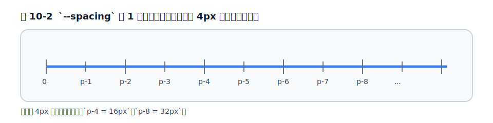
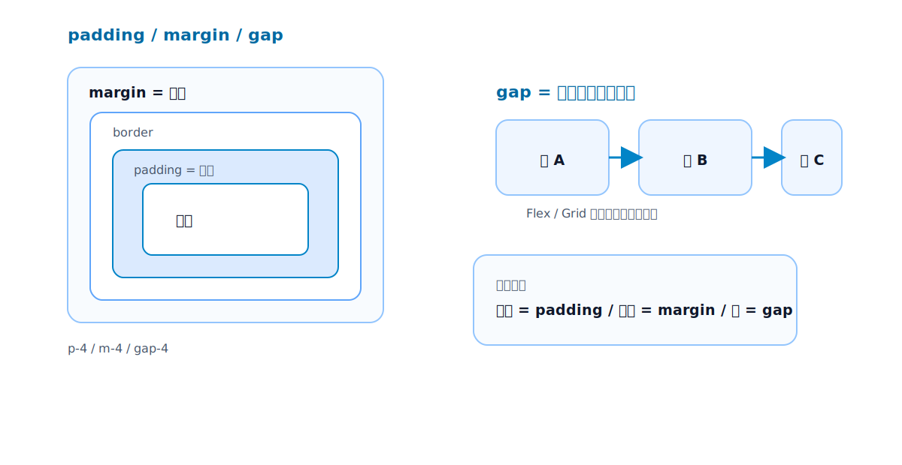

# 第10章 Spacing

## 10.1 spacing スケールの思想

余白は、デザインの印象を最も大きく左右する要素のひとつです。素の CSS では `padding: 16px` のように好きな値を書けますが、[第3章](../part1/chapter3.md)で見たとおり、この自由さがチーム開発では余白のばらつきを生みます。

Tailwind は、余白を<strong>スケール（段階的な値の並び）</strong>として提供します。そして v4 では、このスケールが[第5章](../part2/chapter5.md)で見た `--spacing` というたった 1 つの基準値から計算されます。

```css
/* p-4 が生成する CSS（簡略化） */
.p-4 { padding: calc(var(--spacing) * 4); }
```

`--spacing` の既定値は `0.25rem`（＝ 4px）です。つまり `p-4` は `0.25rem × 4 = 1rem`（16px）になります。数字の `4` が「4px」という意味ではなく、「基準値の 4 倍」だという点が重要です。この仕組みのおかげで、`p-4`・`p-6`・`p-8` のように飛び飛びの値が自然と 4px 刻みで揃い、誰が書いても余白の歩幅がそろいます。

<figure>

<figcaption>図 10-2　spacing スケールの目盛り。`--spacing` を基準に、数字は 4px の倍数として増える。</figcaption>
</figure>

<figure>

<figcaption>図 10-1　padding は内側、margin は外側、gap は子要素どうしの間。役割で使い分ける。</figcaption>
</figure>

## 10.2 padding

要素の**内側**の余白が padding です。クラスの形は方向ごとに分かれています。

```html
<div class="p-4">全方向に内側余白</div>
<div class="px-6 py-3">左右に 6、上下に 3</div>
<div class="pt-8">上だけ 8</div>
```

- `p-*` … 全方向（`padding`）
- `px-*` / `py-*` … 横（`padding-inline`）/ 縦（`padding-block`）
- `pt-*` `pr-*` `pb-*` `pl-*` … 上下左右の個別

v4 では、横方向が `padding-left/right` ではなく **`padding-inline`** という論理プロパティで生成される点も覚えておきましょう。これは「文字の流れる方向」に沿った指定で、日本語・英語のような左横書きでは左右に対応しますが、アラビア語のような右横書き（RTL）では自動で左右が反転します。多言語対応を見据えた設計です。文字方向に合わせて始端・終端を指定したいときは、論理プロパティ版の `ps-*`（始端）・`pe-*`（終端）も使えます。

なお、padding に**マイナスの値はありません**。内側余白を負にすることはできないからです。

## 10.3 margin と負のマージン

要素の**外側**の余白が margin です。形は padding と同じく `m-*` `mx-*` `mt-*` などです。padding と違い、**margin にはマイナスがあります**。

```html
<div class="mt-6">上に外側余白</div>
<div class="-mt-2">上に負のマージン（上に食い込ませる）</div>
```

`-mt-2` のように先頭に `-` を付けると負のマージンになります。重なりを作る、親の padding を打ち消す、といった用途で使います。ただし負のマージンはレイアウトを直感に反して崩しやすいので、多用は禁物です。「重ねたい」意図が明確なときだけに留めましょう。

## 10.4 要素間の間隔: `space-x/y-*` と `gap-*` の違い

「**子要素どうしの間隔**」を空けたい場面はとても多くあります。Tailwind には方法が 2 つあり、使い分けがよく問われます。

**`gap-*`（推奨）**: Flexbox や Grid のコンテナに付けて、子の間の溝を空けます。

```html
<div class="flex gap-4">
  <button>保存</button>
  <button>キャンセル</button>
</div>
```

**`space-x-*` / `space-y-*`**: 隣り合う子要素の間に、片側マージンで間隔を入れます（隣接する要素どうしの間だけに溝ができるイメージです）。

```html
<div class="space-y-4">
  <p>段落1</p>
  <p>段落2</p>
</div>
```

**どちらを使うべきか。** 現在は **`gap-*` が第一候補**です。`gap` は CSS Grid / Flexbox の正式な機能で、要素を折り返したときも間隔が正しく保たれ、子要素を入れ替えても破綻しません。`space-*` はマージンを使うため、子の順序や折り返しで意図せぬ余白が出ることがあります。Flex/Grid コンテナなら `gap`、それ以外でやむを得ないときだけ `space-*`、と覚えておけば十分です。

## 10.5 任意の値とスケール外の値

どうしてもスケールにない余白が必要なら、任意の値が使えます。

```html
<div class="p-[18px]">スケールにない 18px</div>
```

ただし、これを安易に使うのは黄色信号です。`p-[18px]` が現れるのは、たいてい「デザインがスケールに沿っていない」サインです。本当にその値でなければならないのか、`p-4`（16px）や `p-5`（20px）で代用できないかを先に疑ってください。どうしても必要なら、**それをテーマ変数として定義し、名前を付けて再利用する**（[第5章](../part2/chapter5.md)・[第26章](../part7/chapter26.md)）方が、1 回限りの `[18px]` を散らすより健全です。

## 10.6 実務: 一貫した余白設計とアンチパターン

実務では、「余白の値を決める」のではなく「**余白の歩幅を決める**」と考えると、設計がぶれません。たとえば「セクション間は `py-16`、カード内は `p-6`、要素間は `gap-4`」のように、役割ごとに使う値をチームで決めておきます。

避けたいアンチパターンは、**画面ごとに余白がバラバラ**になることです。`p-[13px]`・`mt-[7px]`・`gap-[5px]` のような任意の値が散らばり始めたら、スケールから外れた設計の崩れを疑うべきサインです（詳しくは[第27章](../part7/chapter27.md)）。

## 参考資料

* [Tailwind CSS Docs — Padding](https://tailwindcss.com/docs/padding)
* [Tailwind CSS Docs — Margin](https://tailwindcss.com/docs/margin)
* [Tailwind CSS Docs — Gap](https://tailwindcss.com/docs/gap)
