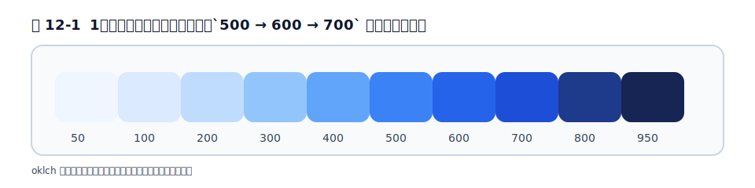

# 第12章 Colors

## 12.1 デフォルトパレットと oklch / P3

色は、Tailwind が「制約のあるデザイン」を最もよく体現する領域です。素の CSS では 1,600 万色から自由に選べますが、それが[第3章](../part1/chapter3.md)で見た「微妙に違う青が散らばる」問題を生みます。

Tailwind は、色を **名前 + 明度の段階**（`red-500`・`blue-600` など）のパレットとして提供します。各色に `50`（最も明るい）から `950`（最も暗い）までの段階があります。そして[第5章](../part2/chapter5.md)で見たとおり、v4 のパレットは **oklch** で定義されています。

```css
--color-red-500: oklch(63.7% 0.237 25.331);
```

oklch は「見た目の明るさ」に沿った色空間なので、`500 → 600 → 700` と数字を上げると素直に暗くなり、配色を組みやすいという利点があります。実務では「oklch という新しい書き方になった」程度の認識で十分ですが、自分で色を足すときも oklch で書くと段階を揃えやすくなります。

<figure>

<figcaption>図 12-1　1色の明度段階をそろえると、`500 → 600 → 700` が迷いにくい。</figcaption>
</figure>

## 12.2 背景・文字・ボーダー・リング色

同じパレットを、適用先ごとに別のクラスで使います。プレフィックスが変わるだけです。

```html
<div class="bg-blue-600 text-white border border-blue-700">
  ボタン
</div>
```

- `bg-*` … 背景色
- `text-*` … 文字色
- `border-*` … ボーダー色
- `ring-*` … リング（フォーカス枠など、[第13章](chapter13.md)）
- `fill-*` / `stroke-*` … SVG の塗り / 線

## 12.3 不透明度の指定

色に透明度を加えたいとき、v4 では色クラスの後ろに `/` と数値を付けます。

```html
<div class="bg-black/50">黒の 50% 透過</div>
<div class="text-blue-600/75">青の 75%</div>
```

この `bg-black/50` は、内部的には CSS の `color-mix()`（第2部で触れたモダン CSS 機能）を使って不透明度を合成しています。`rgba` を手で書く必要がなく、パレットの色をそのまま透かせるのが便利です。

## 12.4 グラデーション

v4 ではグラデーションの表現が大きく広がりました。方向を決める `bg-linear-to-r`（右へ向かう線形グラデーション）などに、開始・中間・終了の色を重ねます。

```html
<div class="bg-linear-to-r from-cyan-500 to-blue-500">線形グラデーション</div>
```

線形だけでなく、放射状（基本形は `bg-radial`、位置を指定するなら `bg-radial-[at_25%_25%]` のように書きます）や円錐（基本形は `bg-conic`、角度を付けるなら `bg-conic-<角度>`）も使えます。装飾過多にならない範囲で、ヒーロー領域やボタンのアクセントに使うとよいでしょう。

## 12.5 テーマでの色のカスタムと意味的な色名

ブランドカラーは、[第5章](../part2/chapter5.md)のとおり `@theme` で定義します。このとき、`--color-brand-blue` のような「見た目の名前」だけでなく、**役割を表す意味的な名前（セマンティックトークン）**も定義しておくと、後が楽になります。

```css
@theme {
  --color-brand: oklch(0.45 0.24 264);   /* ブランド色 */
  --color-surface: oklch(1 0 0);          /* 背景面 */
  --color-danger: oklch(0.58 0.22 27);    /* 危険・エラー */
}
```

こうすると `bg-surface`・`text-danger` のように「意味」で色を呼べます。「エラーは赤」という決定を 1 か所に集約でき、後でブランド色を変えるときも定義の差し替えだけで済みます。これはダークモード（[第18章](../part5/chapter18.md)）やデザインシステム（[第23章](../part6/chapter23.md)）への布石にもなります。

## 12.6 実務: ブランドカラーの組み込みとダークモード前提の設計

実務では、最初から**ダークモードを前提に色を設計**しておくと後悔が減ります。具体的には、`bg-white`・`text-black` のような直接的な色ではなく、12.5 のセマンティックトークン（`bg-surface`・`text-foreground` など）で組んでおき、ダークモード時にトークンの値だけを差し替える、という設計です（[第18章](../part5/chapter18.md)）。`text-[#1a1a1a]` のような任意の色を散らすと、ダークモード対応や配色変更のときに総とっかえになります。色こそ、任意の値を避けてテーマに寄せるべき領域です。

## 参考資料

* [Tailwind CSS Docs — Colors](https://tailwindcss.com/docs/colors)
* [Tailwind CSS Docs — Background color](https://tailwindcss.com/docs/background-color)
* [Tailwind CSS Docs — Theme（色のカスタム）](https://tailwindcss.com/docs/theme)

