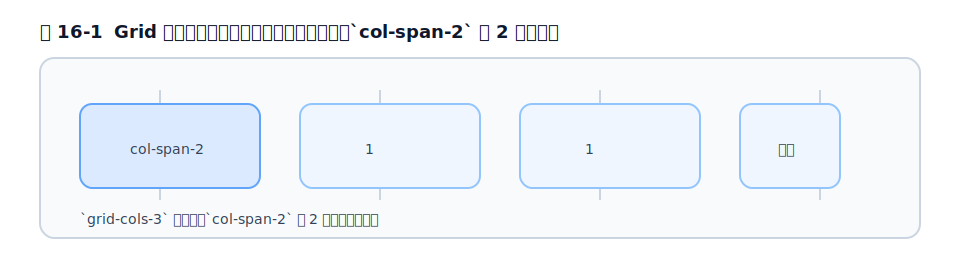

# 第16章 Grid

## 16.1 Grid の素の CSS と Tailwind の対応

CSS Grid は「行と列の**格子**で 2 次元にレイアウトする」手法です。Flexbox が 1 方向の並びを得意とするのに対し、Grid は「縦も横も揃えたい」表組み的なレイアウトに向きます。こちらも対応関係を押さえましょう。

| 素の CSS | Tailwind |
| --- | --- |
| `display: grid` | `grid` |
| `grid-template-columns: repeat(3, minmax(0,1fr))` | `grid-cols-3` |
| `gap: 1rem` | `gap-4` |
| `grid-column: span 2` | `col-span-2` |

<figure>

<figcaption>図 16-1　Grid は「何列ぶん占めるか」を数で扱う。`col-span-2` は 2 列ぶん。</figcaption>
</figure>

## 16.2 列・行の定義

`grid-cols-*` で列数を決めます。`grid-cols-3` は「等幅 3 列」です。

```html
<div class="grid grid-cols-3 gap-4">
  <div>1</div><div>2</div><div>3</div>
</div>
```

このとき生成される CSS はこうです。

```css
.grid-cols-3 { grid-template-columns: repeat(3, minmax(0, 1fr)); }
```

`minmax(0, 1fr)` になっているのは、中身が大きくても列がはみ出さないようにするための定番テクニックで、Tailwind が標準で面倒を見てくれています。複雑なトラックは任意の値で書けます（例: `grid-cols-[200px_1fr]`）。

## 16.3 配置とスパン

子要素を「何列ぶん占めるか」「何列目から始めるか」で配置します。

```html
<div class="grid grid-cols-4 gap-4">
  <div class="col-span-2">2 列ぶん</div>
  <div>1 列</div>
  <div>1 列</div>
</div>
```

- `col-span-*` … 列方向にまたぐ
- `col-start-*` / `col-end-*` … 開始・終了位置
- 行方向は `row-span-*` `row-start-*`

## 16.4 gap と Flexbox との使い分け

Grid でも間隔は `gap-*` で空けます（[第10章](chapter10.md)）。`gap-x-*` / `gap-y-*` で縦横を別々にもできます。

「Flexbox と Grid のどちらを使うか」は実務でよく迷うところですが、目安はシンプルです。**一列（または一行）に並べるだけなら Flexbox、行と列の両方をきっちり揃えたいなら Grid** です。ボタンの横並びは Flex、商品カードの格子は Grid、と考えれば外しません。

## 16.5 動的な列数

第2部で見たとおり、v4 では `grid-cols-15` のような**スケールに用意されていない列数**も、設定なしで動的に生成されます。

```html
<div class="grid grid-cols-7">7 列のカレンダー</div>
```

これは「定義していないクラスがなぜ効くのか」（[第4章](../part2/chapter4.md)）の好例です。とはいえ、極端な列数を任意の値で乱発すると可読性が落ちるので、よく使う列数はレスポンシブの型（次項）に落とし込むのが実務的です。

## 16.6 実務: カードグリッド・ダッシュボード

Grid の実務での主役は、**カード一覧**と**ダッシュボード**です。カード一覧は、画面幅に応じて列数を増やすレスポンシブグリッドが定番です。

```html
<div class="grid grid-cols-1 gap-6 sm:grid-cols-2 lg:grid-cols-3">
  <!-- カードを並べる -->
</div>
```

これは「スマホで 1 列、タブレットで 2 列、PC で 3 列」という、最もよく書くパターンです（レスポンシブは[第17章](../part5/chapter17.md)で深掘りします）。ダッシュボードのように「大きいパネルと小さいパネルを混在させる」レイアウトは、`col-span-*` / `row-span-*` を組み合わせて表現します。

第4部はここまでです。余白・文字・色・装飾・レイアウト・Flex・Grid という、画面を組む道具がそろいました。いずれも第2部の仕組み（`--spacing`・oklch・任意の値・container query）の上に乗っていることを思い出してください。次の第5部では、これらを使って**レスポンシブ・ダークモード・アニメーション・フォーム・アクセシビリティ**という実践的なテーマに踏み込みます。

## 参考資料

* [Tailwind CSS Docs — Grid template columns](https://tailwindcss.com/docs/grid-template-columns)
* [Tailwind CSS Docs — Grid column（span / start / end）](https://tailwindcss.com/docs/grid-column)
* [Tailwind CSS Docs — Gap](https://tailwindcss.com/docs/gap)

---
