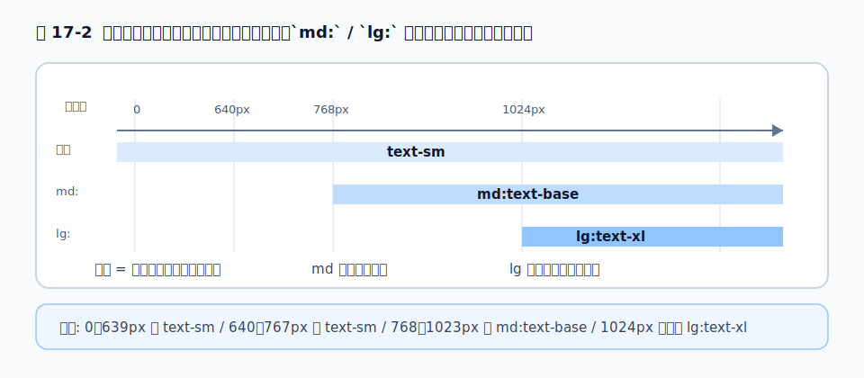
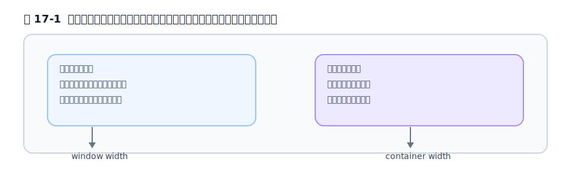

# 第17章 レスポンシブデザイン

## 17.1 モバイルファースト原則

レスポンシブデザインとは、画面幅に応じてレイアウトを変えることです。素の CSS ではメディアクエリ（`@media`）で書きますが、Tailwind では[第6章](../part2/chapter6.md)で見たブレークポイントのバリアント（`sm:` `md:` `lg:` …）を使います。

ここで最も重要な原則が**モバイルファースト**です。Tailwind では、**プレフィックスなしのクラスはすべての画面に効き、`md:` などのプレフィックス付きは「その幅以上」で上書きする**という設計になっています。

```html
<!-- スマホでは縦並び、md 以上で横並び -->
<div class="flex flex-col md:flex-row">...</div>
```

ここでよくある誤解を解いておきます。`md:` は「md サイズのときだけ」ではなく「**md 幅以上のすべて**」を意味します。だから設計の順序は「まず狭い画面（無印）を作り、広くなったら上書きする」になります。`sm:text-left` を「スマホのとき左寄せ」と誤解すると、意図と逆になります。**無印＝土台、プレフィックス＝広い画面での変更**、と覚えてください。

<figure>

<figcaption>図 17-2　モバイルファースト。無印が土台で、`md:`・`lg:` は“その幅以上”を上書きする。</figcaption>
</figure>

## 17.2 デフォルトブレークポイントとカスタム

v4 の既定ブレークポイントは次のとおりです（[第6章](../part2/chapter6.md)で確認した値です）。

| プレフィックス | 最小幅 | 生成される CSS |
| --- | --- | --- |
| `sm:` | 40rem (640px) | `@media (width >= 40rem)` |
| `md:` | 48rem (768px) | `@media (width >= 48rem)` |
| `lg:` | 64rem (1024px) | `@media (width >= 64rem)` |
| `xl:` | 80rem (1280px) | `@media (width >= 80rem)` |
| `2xl:` | 96rem (1536px) | `@media (width >= 96rem)` |

カスタムしたいときは、[第5章](../part2/chapter5.md)のとおり `@theme` で `--breakpoint-*` を定義します。たとえば `--breakpoint-3xl: 120rem;` と書けば `3xl:` が使えるようになります。

## 17.3 範囲指定・`max-*` バリアント

「ある幅**以上**」だけでなく「ある幅**未満**」を指定したいこともあります。そのときは `max-*` バリアントを使います。

```html
<div class="max-md:hidden">md 未満では隠す</div>
```

`md:` と `max-*` を組み合わせると、「md 以上 xl 未満だけ」のような**範囲指定**もできます。

```html
<div class="md:max-xl:flex">md 以上 xl 未満のときだけ flex</div>
```

ただし範囲指定は読みにくくなりがちなので、本当に必要なときに限るのが無難です。

## 17.4 メディアクエリ vs Container Queries

ここが現代のレスポンシブで最も大切な使い分けです。[第14章](../part4/chapter14.md)で触れた**Container Queries**（コンテナクエリ）との違いを整理します。

- **ブレークポイント（`md:` など）= 画面の幅に反応する。** ページ全体のレイアウトを切り替えるのに向く。
- **コンテナクエリ（`@md:` など）= 親要素の幅に反応する。** 「どこに置かれるか分からないコンポーネント」を、置かれた場所の幅に応じて変えるのに向く。

```html
<!-- このカードは、画面ではなく自分の親の幅で形を変える -->
<div class="@container">
  <article class="flex flex-col @md:flex-row">...</article>
</div>
```

同じカードを、広いメイン領域に置いても狭いサイドバーに置いても、それぞれの幅に合わせて自律的に振る舞えます。**ページ全体の構成はブレークポイント、再利用するコンポーネントはコンテナクエリ**、という使い分けを覚えておくと、設計がぐっと洗練されます。

<figure>

<figcaption>図 17-1　メディアクエリとコンテナクエリの違い。画面か親要素かで反応先が違う。</figcaption>
</figure>

## 17.5 実務: ブレークポイント設計のアンチパターン

実務で最もありがちな失敗は、**ブレークポイントを刻みすぎる**ことです。`sm:` `md:` `lg:` `xl:` `2xl:` すべてに別々の値を指定したクラスが並ぶと、もはや誰も挙動を追えません。

```html
<!-- アンチパターン: 分岐が多すぎる -->
<div class="text-sm sm:text-base md:text-lg lg:text-xl xl:text-2xl">...</div>
```

多くの場合、切り替えは 1〜2 段階で十分です。「スマホと PC の 2 パターン」を基本に考え、どうしても必要なときだけ中間を足す。これだけで、レスポンシブはずっと保守しやすくなります。

## 参考資料

* [Tailwind CSS Docs — Responsive design](https://tailwindcss.com/docs/responsive-design)
* [Tailwind CSS Docs — Responsive design（Container queries の節）](https://tailwindcss.com/docs/responsive-design)

