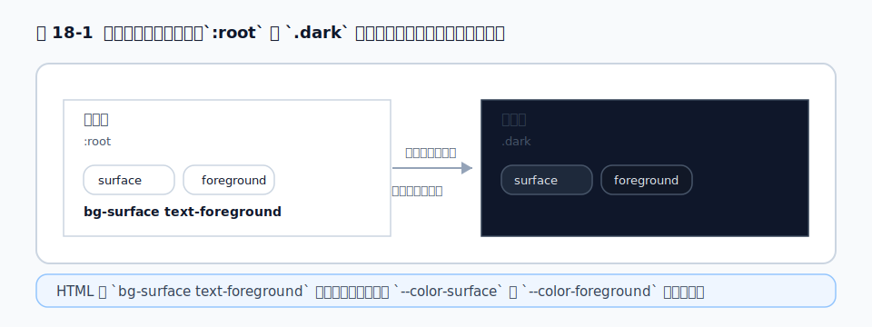

# 第18章 ダークモード

## 18.1 `dark:` バリアントの仕組み

ダークモードは、`dark:` バリアントで実現します。[第6章](../part2/chapter6.md)で見たとおり、これは「ダークモードのときだけ効くスタイル」を生成するバリアントです。

```html
<div class="bg-white text-gray-900 dark:bg-gray-900 dark:text-gray-100">
  ライトでは白地・黒字、ダークでは黒地・白字
</div>
```

無印（`bg-white text-gray-900`）がライトモードの見た目、`dark:` 付きがダークモードでの上書きです。[第17章](chapter17.md)のモバイルファーストと同じ「土台＋上書き」の構造です。

## 18.2 `media`（OS 連動）と `class`/`selector`（手動切替）戦略

ダークモードの「効くタイミング」には、大きく 2 つの戦略があります。

- **OS 連動（既定）**: 利用者の OS 設定（`prefers-color-scheme`）に従って自動で切り替わります。設定不要で、`dark:` がそのまま OS のダークモードに反応します。
- **手動切替（クラス方式）**: ページ内のトグルボタンで切り替えたい場合。`<html>` などに `.dark` クラスが付いているときだけ `dark:` を効かせます。

「ユーザーに切り替えボタンを提供したい」なら、後者の手動切替を選びます。

## 18.3 v4 でのダークモード設定（`@custom-variant dark`）

手動切替にするには、[第6章](../part2/chapter6.md)で触れた `@custom-variant` を使って `dark:` の意味を上書きします。v4 では CSS にこう書きます。

```css
@import "tailwindcss";

@custom-variant dark (&:where(.dark, .dark *));
```

これで `dark:` は「OS 設定」ではなく「**祖先に `.dark` クラスがあるとき**」に効くようになります。あとは JavaScript で `<html>` に `.dark` を付け外しすれば、テーマが切り替わります。

```js
// ダークにする / 戻す
document.documentElement.classList.toggle('dark')
```

> v3 を知っている人へ: v3 では `tailwind.config.js` に `darkMode: 'class'` と書きました。v4 ではこの設定が CSS の `@custom-variant` に移りました。

## 18.4 トグル実装とちらつき対策

手動切替で必ずぶつかるのが、<strong>初期表示のちらつき（FOUC: Flash of Unstyled Content）</strong>です。ページ読み込み時、JavaScript で `.dark` を付ける前に一瞬ライトモードが表示され、直後に暗転する——この不快なちらつきです。

原因は、「`.dark` を付ける JavaScript が、画面の描画より後に走る」ことです。対策は、**描画前（`<head>` の早い段階）に、同期的なスクリプトで `.dark` を決定する**ことです。

```html
<!-- <head> の早い位置に置く同期スクリプト -->
<script>
  if (localStorage.theme === 'dark' ||
      (!('theme' in localStorage) &&
       window.matchMedia('(prefers-color-scheme: dark)').matches)) {
    document.documentElement.classList.add('dark')
  }
</script>
```

保存済みの設定（`localStorage`）か OS 設定を見て、最初の描画より前にクラスを付けます。Rails でも React/Next.js でも、考え方は同じです。Rails ならレイアウトの `<head>` にこのスクリプトを直接書きます。Next.js（App Router）では、同様のスクリプトを `<head>` に同期実行で差し込みます。これは、テーマをブラウザの `localStorage` に保存する場合の定石です。

なお、テーマを **Cookie やデータベースに保存する**設計であれば、サーバー側でユーザーの設定を知れるので、最初から `<html class="dark">` をサーバーレンダリングして出力できます。この場合は描画前のスクリプトが不要になり、ちらつきも原理的に起きません（公式ドキュメントもこの方法に触れています）。「クライアント保存ならスクリプト、サーバー保存なら初期クラスを出力」と使い分けると覚えてください。

## 18.5 実務: 色設計をダークモード前提にする

ダークモード対応で苦労しないコツは、[第12章](../part4/chapter12.md)でも触れたとおり、**最初からセマンティックトークンで色を組む**ことです。

`dark:` を要素ごとにベタ書きすると、`bg-white dark:bg-gray-900` のような対が画面中に散らばり、後で色を調整するのが地獄になります。代わりに、[第5章](../part2/chapter5.md)のテーマ変数を使い、`.dark` のときに変数の値だけを差し替える設計にします。

```css
@theme {
  --color-surface: oklch(1 0 0);       /* ライトの背景 */
  --color-foreground: oklch(0.2 0 0);  /* ライトの文字 */
}

.dark {
  --color-surface: oklch(0.2 0 0);     /* ダークでは反転 */
  --color-foreground: oklch(0.95 0 0);
}
```

こうしておけば、HTML は `bg-surface text-foreground` と書くだけで両モードに対応します。`dark:` を個別に書く量が激減し、配色の調整も CSS 変数の 1 か所で済みます。

<figure>

<figcaption>図 18-1　ダークモード: 同じ class のまま、`:root` と `.dark` でトークン値を差し替えて色が変わる。</figcaption>
</figure>

## 参考資料

* [Tailwind CSS Docs — Dark mode](https://tailwindcss.com/docs/dark-mode)
* [Tailwind CSS Docs — Functions and directives（@custom-variant）](https://tailwindcss.com/docs/functions-and-directives)
