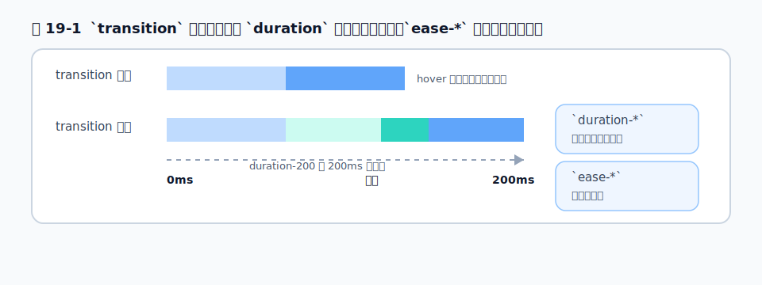
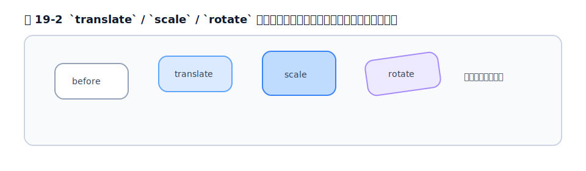

# 第19章 アニメーション

## 19.1 transition

アニメーションの基本は**トランジション**——状態が変わるときに、見た目をなめらかに変化させることです。`hover:` などで色やサイズが変わるとき、`transition` を付けると瞬間的にではなく徐々に変化します。

```html
<button class="bg-blue-500 transition hover:bg-blue-700 duration-200 ease-out">
  ホバーでなめらかに色が変わる
</button>
```

- `transition` … トランジションを有効にする
- `duration-200` … 変化にかける時間（200ms）
- `ease-out` … 変化の緩急（イージング）
- `delay-*` … 開始を遅らせる

<figure>

<figcaption>図 19-1　`transition` は状態の変化を `duration` の時間で滑らかにつなぐ。`ease-*` は変化の緩急を決める。</figcaption>
</figure>

## 19.2 transform

**トランスフォーム**は、要素を移動・拡大・回転させます。レイアウトに影響を与えずに見た目を動かせるので、アニメーションと相性が良い機能です。

```html
<div class="transition hover:scale-105 hover:-translate-y-1">
  ホバーで少し拡大して浮き上がる
</div>
```

- `translate-x-*` / `translate-y-*` … 移動
- `scale-*` … 拡大・縮小
- `rotate-*` … 回転

v4 では、これらが個別の CSS プロパティ（`translate`・`scale`・`rotate`）として扱われるようになり、3D の変形（`rotate-x-*` など）も扱えます。

<figure>

<figcaption>図 19-2　transform の 3 種は、レイアウトを動かさず見た目だけを変える。</figcaption>
</figure>

## 19.3 組み込みアニメーションとカスタム

繰り返し動き続けるアニメーションには、組み込みのユーティリティがあります。

```html
<svg class="animate-spin">...</svg>   <!-- 回転（ローディング） -->
<div class="animate-pulse">...</div>   <!-- 点滅（スケルトン表示） -->
```

- `animate-spin` … 回転し続ける（ローディングスピナー）
- `animate-pulse` … ゆっくり点滅（読み込み中のプレースホルダー）
- `animate-bounce` … 跳ねる

独自のアニメーションは、[第5章](../part2/chapter5.md)のテーマで `--animate-*` を定義して追加します。`@theme` に `@keyframes` とあわせて定義することで、`animate-自分の名前` が使えるようになります。

## 19.4 入場アニメーション `@starting-style`

「要素が現れる瞬間」をアニメーションさせたい場面——モーダルやポップオーバーがふわっと出てくる演出——は、従来 JavaScript が必要でした。v4 は、モダン CSS の **`@starting-style`** に対応する `starting:` バリアントを用意しており、これを CSS だけで書けます。

`starting:` は「要素が DOM に最初に現れた瞬間（または `display: none` から表示に変わった瞬間）の、開始時点の見た目」を指定します。

```html
<div popover id="menu"
     class="opacity-100 transition-opacity starting:opacity-0">
  ふわっと現れるメニュー
</div>
```

「開始時は透明（`starting:opacity-0`）→ 表示後は不透明（`opacity-100`）」へ、`transition` でなめらかにつなぎます。JavaScript なしで入場アニメーションが書けるのは、v4 がモダン CSS の薄いラッパーであることの好例です。

## 19.5 `motion-reduce` への配慮

アニメーションは、すべての人にとって快適とは限りません。前庭障害などのある人にとって、動きの多い画面は不快や体調不良の原因になります。OS には「視差効果を減らす（reduce motion）」設定があり、これを尊重するのがアクセシビリティの基本です。

Tailwind では `motion-reduce:` バリアントで対応します。

```html
<div class="animate-bounce motion-reduce:animate-none">
  通常は跳ねるが、reduce motion 設定なら止まる
</div>
```

`motion-reduce:animate-none` で、reduce motion を有効にしているユーザーには動きを止めます。逆に `motion-safe:`（動きを許可している人にだけ animate を付ける）という書き方もあります。**装飾的なアニメーションには、原則この配慮をセットにする**習慣をつけましょう（[第21章](chapter21.md)）。

## 19.6 実務: マイクロインタラクションと過剰演出の回避

実務でのアニメーションは、**控えめなマイクロインタラクション**（ボタンのホバー、フォーカス時のリング、読み込み中の表示など）に効果を発揮します。ユーザーに「反応した」という手応えを返すのが目的です。

逆に避けたいのは、過剰な演出です。スクロールのたびに要素が派手に動く、画面遷移ごとに大きなアニメーションが入る、といった演出は、最初は楽しくてもすぐに鬱陶しくなり、操作の邪魔になります。「気づかないくらい自然」が良いアニメーションの目安です。`duration-200` 前後の短いトランジションを基本に、`motion-reduce` への配慮を忘れずに、が実務の定石です。

## 参考資料

* [Tailwind CSS Docs — Transition property](https://tailwindcss.com/docs/transition-property)
* [Tailwind CSS Docs — Translate](https://tailwindcss.com/docs/translate)
* [Tailwind CSS Docs — Scale](https://tailwindcss.com/docs/scale)
* [Tailwind CSS Docs — Rotate](https://tailwindcss.com/docs/rotate)
* [Tailwind CSS Docs — Animation](https://tailwindcss.com/docs/animation)
* [Tailwind CSS Docs — Hover, focus & other states（starting / motion-reduce）](https://tailwindcss.com/docs/hover-focus-and-other-states)

---
