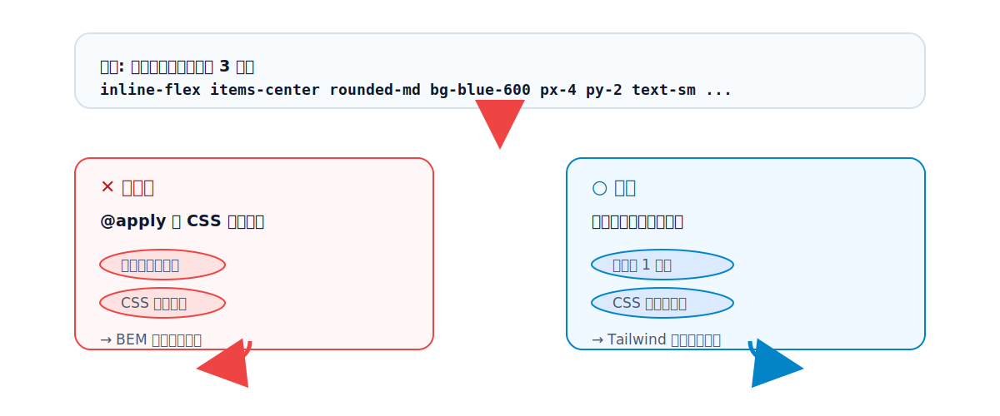

# 第22章 UI コンポーネントを作る

## 22.1 「重複」をどう捉えるか

まず大前提として、Tailwind における重複は「悪」と決めつけないことが大切です。`p-4`・`bg-white` のようなユーティリティが画面のあちこちに現れるのは、[第3章](../part1/chapter3.md)で見たとおり**設計どおり**であって、問題ではありません。生成される CSS は `.p-4` ひとつだけなので、いくら使っても CSS は増えません。

問題になるのは、**「ボタン」「カード」のような意味のあるまとまりが、長いクラス列ごと何度も複製される**ときです。

```html
<!-- 同じボタンを 3 か所に……長いクラス列が複製される -->
<button class="inline-flex items-center rounded-md bg-blue-600 px-4 py-2 text-sm font-medium text-white shadow-sm hover:bg-blue-700">保存</button>
<button class="inline-flex items-center rounded-md bg-blue-600 px-4 py-2 text-sm font-medium text-white shadow-sm hover:bg-blue-700">送信</button>
<button class="inline-flex items-center rounded-md bg-blue-600 px-4 py-2 text-sm font-medium text-white shadow-sm hover:bg-blue-700">更新</button>
```

これだと、ボタンのデザインを変えるとき 3 か所すべてを直す必要があり、修正漏れも起きます。これこそが「コンポーネント化で解決すべき重複」です。

重複への対処には、大きく 2 つの方向があります。1 つは `@apply` で CSS にまとめる方法、もう 1 つはテンプレート/コンポーネントとして抽出する方法です。順に見ていきます。

## 22.2 `@apply` の役割と落とし穴

`@apply` は、ユーティリティクラスを**自前の CSS クラスの中に展開する**ディレクティブです（第2部）。

```css
.btn-primary {
  @apply inline-flex items-center rounded-md bg-blue-600 px-4 py-2 text-sm font-medium text-white shadow-sm hover:bg-blue-700;
}
```

```html
<button class="btn-primary">保存</button>
```

これを見ると、「HTML がすっきりして最高では？」と思うかもしれません。実際、`@apply` は便利に**見えます**。しかし、ここには大きな落とし穴があります。

`@apply` で `.btn-primary` を作るということは、**[第1章](../part1/chapter1.md)で見た「セマンティックなクラス名を作る世界」に逆戻りしている**ということです。考えてみてください。

- `.btn-primary` という**名前を考える**必要が再び生まれる（命名コストの復活）。
- このクラスは CSS ファイルに存在するので、**CSS が再び増えていく**（線形に増えない、という利点の放棄）。
- 見た目を知るには、HTML から CSS ファイルへ**行き来する**必要が戻ってくる。
- 結局、BEM 時代と同じ「グローバルな CSS クラス」を管理することになる。

つまり `@apply` を多用すると、Tailwind を導入してわざわざ捨てたはずの問題が、そっくり戻ってくるのです。HTML が一瞬きれいに見える代償として、Tailwind の利点をほとんど手放してしまいます。

## 22.3 `@apply` よりコンポーネント抽出が推奨される理由

では作者やコミュニティは、重複にどう対処せよと言っているのでしょうか。答えは明確で、**`@apply` ではなく、テンプレートやコンポーネントとして抽出せよ**、です。

Tailwind 公式ドキュメントも、重複の管理方法として最初に挙げるのは「テンプレートのループ」や「コンポーネント/部分テンプレートへの抽出」であり、`@apply` は最後にわずかに触れられるだけです。さらに公式は、`@apply` について「**マークアップを整理したいという理由だけで使うのは避けるべき**」という趣旨の注意を添えています。

理由は 22.2 の裏返しです。コンポーネント抽出なら、

- **命名は最小限で済む**（`Button` という部品名は要るが、CSS クラスの命名体系は不要）。
- **CSS は増えない**（クラス列は HTML/テンプレート側にあるまま）。
- **見た目はその場で分かる**（コンポーネントの定義を 1 か所見ればよい）。
- **props でバリエーションを表現できる**（色やサイズを引数で変えられる。`@apply` ではできない）。

`@apply` が正当化されるのは、ごく限られた場面だけです。たとえば、自分でコントロールできない外部のマークアップ（第三者のウィジェットなど）にスタイルを当てる必要があり、かつコンポーネント化できないケース。こうした例外を除けば、**重複は CSS にではなく、テンプレート/コンポーネントに畳み込む**——これが鉄則です。

<figure>

<figcaption>図 22-1　重複への2つの対処。`@apply` は BEM 時代の問題に逆戻りし、コンポーネント抽出は Tailwind の利点を保つ。</figcaption>
</figure>

## 22.4 ボタンを題材にした抽出

「抽出」とは具体的にどうすることか。同じボタンを、各環境での部品にまとめてみます。クラス列が現れるのは**定義の 1 か所だけ**になり、使う側はすっきりします。

**HTML だけの場合（テンプレートのループ）**: データを配列にして繰り返せば、クラス列は 1 か所で済みます。

**Rails（部分テンプレート）**:

```erb
<%# app/views/shared/_button.html.erb %>
<button class="inline-flex items-center rounded-md bg-blue-600 px-4 py-2 text-sm font-medium text-white shadow-sm hover:bg-blue-700">
  <%= label %>
</button>
```

```erb
<%= render "shared/button", label: "保存" %>
```

**React（コンポーネント）**:

```tsx
function Button({ children }: { children: React.ReactNode }) {
  return (
    <button className="inline-flex items-center rounded-md bg-blue-600 px-4 py-2 text-sm font-medium text-white shadow-sm hover:bg-blue-700">
      {children}
    </button>
  )
}
```

```tsx
<Button>保存</Button>
```

どちらも、長いクラス列は部品の中に 1 度だけ書かれ、呼び出し側は `render "shared/button"` や `<Button>` と書くだけです。これが「重複を CSS ではなくコンポーネントに畳み込む」ということです。

## 22.5 カスタムユーティリティとコンポーネントクラスの境界

ここで線引きを整理しておきます。「自前の CSS クラスを作るな」と言っているわけではありません。問題は「何を CSS に置き、何をコンポーネントに置くか」です。

- **コンポーネント（ボタン、カードなど意味のあるまとまり）** → テンプレート/コンポーネントに抽出する（`@apply` で CSS クラスにしない）。
- **本当に汎用的な、単機能の拡張** → v4 の `@utility` でカスタムユーティリティとして定義してよい。

`@utility` は、Tailwind の流儀に沿った「新しいユーティリティを 1 つ足す」仕組みです（第2部・[第26章](../part7/chapter26.md)）。

```css
@utility content-auto {
  content-visibility: auto;
}
```

これは `content-auto` という**単機能のユーティリティ**を増やすもので、`hover:` などのバリアントとも組み合わせられます。「ボタン全体」のような複合的なまとまりを 1 クラスに押し込む `@apply` とは、性質がまったく違います。**複合的なまとまりはコンポーネントへ、単機能の拡張は `@utility` へ**——この境界を覚えておけば、CSS を不健全に太らせずに済みます。

## 参考資料

* [Tailwind CSS Docs — Styling with utility classes（Managing duplication / Avoiding @apply）](https://tailwindcss.com/docs/styling-with-utility-classes)
* [Tailwind CSS Docs — Functions and directives（@apply / @utility）](https://tailwindcss.com/docs/functions-and-directives)

