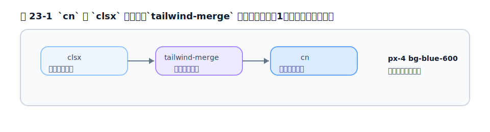

# 第23章 再利用性を高める

[第22章](chapter22.md)で「コンポーネントに抽出する」方針が固まりました。この章では、抽出したコンポーネントを**実用的に使えるものにする**ための道具を見ます。ボタンに色やサイズのバリエーションを持たせたり、外から追加のクラスを受け取れるようにしたりする工夫です。主に React/JavaScript の文脈ですが、考え方は Rails にも応用できます（[第24章](chapter24.md)）。

## 23.1 クラス名が長くなる問題への現実的対処

コンポーネントに抽出しても、「中のクラス列が長い」こと自体は変わりません。これは Tailwind の本質的なトレードオフ（[第3章](../part1/chapter3.md)）なので、なくすことはできません。現実的な対処は次の通りです。

- **長いクラス列が見えるのは定義の 1 か所だけ**にする（[第22章](chapter22.md)の抽出）。
- **クラスの並び順をそろえる**（[第9章](../part3/chapter9.md)の `prettier-plugin-tailwindcss`）。
- **バリアントごとにクラスを整理する**（後述の CVA）。

「長さをゼロにする」のではなく「長さを 1 か所に閉じ込めて管理する」のが、実務的なゴールです。

## 23.2 条件付きクラスの組み立て（clsx / classnames）

コンポーネントでは、「状態に応じてクラスを付け外しする」ことが頻繁にあります。たとえば「選択中なら背景を青く」といった具合です。素朴に書くと、文字列の連結で読みにくくなります。

これを整理するのが **`clsx`**（や同種の `classnames`）です。条件に応じて className 文字列を組み立てる、ごく小さなユーティリティです。

```tsx
import clsx from 'clsx'

clsx('px-4 py-2', isActive && 'bg-blue-600 text-white', isDisabled && 'opacity-50')
// isActive が true なら 'px-4 py-2 bg-blue-600 text-white'
```

`false` や `null` は自動で無視されるので、三項演算子や `&&` で素直に条件分岐を書けます。

## 23.3 クラス衝突の解消（tailwind-merge）

`clsx` には解決できない問題があります。**クラスの衝突**です。[第4章](../part2/chapter4.md)で見たとおり、`p-4` と `p-8` のように同じプロパティを扱うクラスを両方並べても、勝つのは CSS 上の順序で決まり、HTML の並び順では決まりません。これはコンポーネントに「外から上書き用のクラスを渡したい」ときに困ります。

```tsx
// 中で p-2、外から p-4 を渡したい → 単純連結だと両方残り、意図通りにならない
<Button className="p-4" />  // 中: 'p-2' + 外: 'p-4' = 'p-2 p-4'
```

これを解決するのが **`tailwind-merge`** です。Tailwind のクラスを賢く解釈し、**衝突するものは後勝ちで 1 つにまとめて**くれます。

```ts
import { twMerge } from 'tailwind-merge'

twMerge('px-2 py-1 bg-red-500', 'p-3 bg-blue-500')
// → 'p-3 bg-blue-500'（px-2 py-1 は p-3 に、bg-red-500 は bg-blue-500 に吸収）
```

実務では、`clsx`（条件分岐）と `twMerge`（衝突解消）を組み合わせた **`cn` というヘルパー**を用意するのが定番です。

<figure>

<figcaption>図 23-1　`cn` の役割分担。`clsx` で集め、`tailwind-merge` で衝突を解消し、最終クラス列にする。</figcaption>
</figure>

```ts
// よくある cn ヘルパー
import { clsx, type ClassValue } from 'clsx'
import { twMerge } from 'tailwind-merge'

export function cn(...inputs: ClassValue[]) {
  return twMerge(clsx(inputs))
}
```

役割分担は明確です。**`clsx` が「条件に応じて集める」、`tailwind-merge` が「衝突を解いて最終的な 1 列にする」**。この `cn` が、次章以降のコンポーネント設計の土台になります。

## 23.4 バリアント設計: Class Variance Authority（CVA）

ボタンには「色（primary / secondary / danger）」「サイズ（sm / md / lg）」のようなバリエーションが付きものです。これを `clsx` の条件分岐だけで書くと、すぐにごちゃごちゃになります。

ここで使うのが **CVA（Class Variance Authority）** です。これは「**どの props のとき、どのクラスを当てるか**」を宣言的に定義できるライブラリで、型安全にバリアントを管理できます（Joe Bell によるメンテナンス）。

```ts
import { cva } from 'class-variance-authority'

const button = cva(
  // 常に当たる基本クラス
  'inline-flex items-center rounded-md font-medium',
  {
    variants: {
      intent: {
        primary: 'bg-blue-600 text-white hover:bg-blue-700',
        secondary: 'bg-gray-100 text-gray-900 hover:bg-gray-200',
        danger: 'bg-red-600 text-white hover:bg-red-700',
      },
      size: {
        sm: 'px-3 py-1.5 text-sm',
        md: 'px-4 py-2 text-sm',
        lg: 'px-6 py-3 text-base',
      },
    },
    defaultVariants: { intent: 'primary', size: 'md' },
  }
)

button({ intent: 'danger', size: 'lg' })
// → 基本クラス + danger のクラス + lg のクラス
```

`intent` や `size` という props と、当てるクラスの対応が 1 か所にまとまり、見通しが格段に良くなります。しかも TypeScript で「存在しないバリアントを渡したらエラー」にできるので、安全です。

## 23.5 デザイントークンを単一の真実にする

ここまでの道具（`cn`・CVA）は、あくまで「クラスをどう組み立てるか」の話です。その土台として、**何色・何 px を使うか**は、[第5章](../part2/chapter5.md)のテーマ（`@theme`）に集約しておくべきです。

CVA のバリアントに `bg-blue-600` のような直値を書いていても、その `blue-600` 自体はテーマで定義されたトークンです。さらに[第12章](../part4/chapter12.md)で触れたセマンティックトークン（`bg-primary` など）をテーマに用意しておけば、CVA の定義も `bg-primary` のように意味で書けて、ブランド変更にも強くなります。**「値はテーマ、組み立ては CVA/cn」**という二層構造が、保守しやすいコンポーネントの基本形です。

## 23.6 実務: デザインシステムへの育て方

これらを組み合わせると、自然と「自分たちのデザインシステム」が育ちます。育て方の順序はこうです。

1. まずベタ書きで作る（早く動かす）。
2. 重複してきたらコンポーネントに抽出する（[第22章](chapter22.md)）。
3. バリエーションが増えてきたら CVA で整理する。
4. 共通の値はデザイントークンに集約する。

最初から完璧なデザインシステムを作ろうとせず、**重複が痛くなってきた箇所から段階的に育てる**のが、現実的で失敗しにくいやり方です。

## 23.7 AI 生成コードとクラス設計

近年は、ChatGPT や Cursor、Copilot のような AI が Tailwind のコードを生成する機会が増えました。AI は Tailwind を出力しやすい（クラスがそのまま見た目を表し、学習データも豊富なため）一方で、**長いクラス列をベタ書きで吐き、任意の値やトークンを無視した直値を混ぜがち**という傾向があります。

そこで、本章の道具が AI 時代にこそ効きます。AI が生成した長いクラス列を、人間が **CVA やコンポーネントへ畳み込み**、直値はデザイントークンに寄せて整える。AI には「既存のテーマ変数とコンポーネント規約に従って」と前提を渡す（[第26章](../part7/chapter26.md)・付録E）。生成して終わりにせず、本章の設計に取り込むことで、AI の速度と設計の一貫性を両立できます。

## 参考資料

* [clsx（GitHub）](https://github.com/lukeed/clsx)
* [tailwind-merge（GitHub）](https://github.com/dcastil/tailwind-merge)
* [Class Variance Authority（公式サイト）](https://cva.style/)
* [Tailwind CSS Docs — Theme](https://tailwindcss.com/docs/theme)

---
