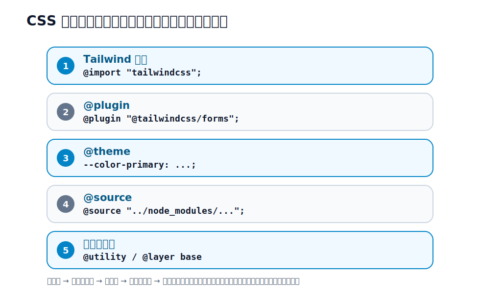

# 第26章 プロジェクト構成

## 26.1 CSS エントリの構成

Tailwind プロジェクトの心臓は、たった 1 つの CSS エントリファイルです。ここがとっ散らかると全体が荒れるので、**書く順序を決めておく**ことが運用の第一歩です。おすすめの並びはこうです。

```css
/* app/assets/tailwind/application.css などのエントリ */

/* 1. Tailwind 本体 */
@import "tailwindcss";

/* 2. 公式・サードパーティのプラグイン */
@plugin "@tailwindcss/typography";

/* 3. テーマ（デザイントークン）の定義 */
@theme {
  --color-brand: oklch(0.45 0.24 264);
  --font-display: "Inter", sans-serif;
}

/* 4. 追加で走査したいソース（必要時のみ） */
@source "../../../node_modules/some-ui-lib";

/* 5. カスタムユーティリティ・ベーススタイル */
@utility content-auto {
  content-visibility: auto;
}
```

「**本体 → プラグイン → テーマ → ソース指定 → 自前の追加**」という順序を固定しておくと、どこに何を書くか迷いません。チームで共有する規約として、ファイル冒頭にコメントでこの構成を書いておくのも有効です。

<figure>

<figcaption>図 26-1　CSS エントリは、`@import`、`@plugin`、`@theme`、`@source`、自前の追加の順に並べる。</figcaption>
</figure>

## 26.2 テーマ・トークンの置き場所と命名規約

[第5章](../part2/chapter5.md)で見たテーマ変数は、プロジェクトの「デザインの真実」です。実務では、命名規約を決めておくと一貫性が保てます。

- **原始トークン（色そのもの）**: `--color-blue-600` のような、Tailwind 標準に沿った名前。
- **セマンティックトークン（役割の名前）**: `--color-primary`・`--color-surface`・`--color-danger` のような、意味を表す名前（[第12章](../part4/chapter12.md)）。

実務では、**セマンティックトークンを中心に使う**設計が保守に強くなります。「プライマリは青」という決定を 1 か所に集約でき、ブランド変更やダークモード（[第18章](../part5/chapter18.md)）にも一括で対応できるからです。トークンが増えてきたら、テーマ定義を別ファイルに切り出して `@import` するのもよいでしょう。

## 26.3 カスタムユーティリティ／コンポーネント／プラグインの置き分け

ここは混乱しやすいので、「何をどこに置くか」を整理します。[第22章](../part6/chapter22.md)の境界の話を、構成の観点で具体化したものです。

| 作りたいもの | 使う仕組み | 置き場所 |
| --- | --- | --- |
| 単機能の新しいユーティリティ | `@utility`（第2部） | CSS エントリ |
| 複合的な部品（ボタン等） | コンポーネント（第6部） | テンプレート/コンポーネント側 |
| ベースの土台スタイル | `@layer base` | CSS エントリ |
| 既存の JS プラグイン | `@plugin` | CSS エントリ |

**`@plugin` と公式プラグインについて。** `@tailwindcss/typography`（[第11章](../part4/chapter11.md)）や `@tailwindcss/forms`（[第20章](../part5/chapter20.md)）は、JavaScript で書かれたプラグインです。v4 では、これらを CSS エントリで `@plugin "..."` と読み込みます。`@plugin` は、こうした **JavaScript ベースのプラグインを CSS から読み込むための互換的なディレクティブ**という位置づけです。テーマのカスタマイズ自体は `@theme`（[第5章](../part2/chapter5.md)）で CSS だけで完結しますが、既存の JS プラグインを使いたいときに `@plugin` を用います。

```css
@import "tailwindcss";
@plugin "@tailwindcss/typography";
@plugin "@tailwindcss/forms";
```

> v3 を知っている人へ: v3 ではプラグインを `tailwind.config.js` の `plugins: [...]` に書きました。v4 ではこれが CSS の `@plugin` ディレクティブに移りました。

ここで役割分担をはっきりさせておきます。[第11章](../part4/chapter11.md)・[第20章](../part5/chapter20.md)では公式プラグインの**使い方**（`prose` や `form-input` をどう書くか）を扱いました。本章で扱うのは、それらを**プロジェクトのどこで管理するか**（CSS エントリの `@plugin` に集約する）という運用面です。

## 26.4 大規模化への備え

プロジェクトが大きくなると、いくつか備えが要ります。

- **ファイル分割**: テーマやカスタムユーティリティが膨らんだら、`@import "./theme.css";` のように分割します。
- **`@source` の活用**: 自動コンテンツ検出（[第4章](../part2/chapter4.md)）から外れる場所（外部パッケージ内のテンプレートなど）のクラスを拾うには `@source` を足します。逆に走査不要な巨大ディレクトリは `@source not` で除外し、ビルドを軽くできます。
- **モノレポ**: 複数アプリで共通のデザインを使うなら、テーマ定義を共有パッケージに切り出し、各アプリの CSS エントリから読み込む構成が有効です。

## 26.5 CI でのビルドと出力サイズの監視

Tailwind は使ったクラスだけを生成する（[第4章](../part2/chapter4.md)）ので、CSS は基本的に小さく保たれます。とはいえ、任意の値の乱発などで肥大化することはあるため、**CI で出力 CSS のサイズを監視**しておくと、異常な増加に早く気づけます。ビルドが通ることと、生成サイズが極端に増えていないことを、CI のチェックに含めるとよいでしょう。

なお、コンポーネントの**見た目**が崩れていないかの確認は、必要に応じて Storybook や視覚回帰テストで行います。ただしこれらは Tailwind 固有の話ではなくフロントエンド運用一般の話題なので、本書では深入りせず「そういう手段がある」とだけ押さえておきます。

## 26.6 チームでのクラス順統一・レビュー観点

チーム開発では、クラスの**並び順**を統一すると、レビューが格段に楽になります。[第9章](../part3/chapter9.md)の `prettier-plugin-tailwindcss` を CI/コミット時に効かせ、並び順を自動でそろえるのが定石です。これで「並べ方」を巡る不毛な議論と差分がなくなります。

レビューでは、次のような観点を持つとよいでしょう。

- 任意の値（`[...]`）が乱発されていないか（[第27章](chapter27.md)）。
- 動的に組み立てたクラス名がないか（[第4章](../part2/chapter4.md)・[第27章](chapter27.md)）。
- 直値ではなくデザイントークンを使っているか。
- 同じ長いクラス列が複製されていないか（コンポーネント化の機会、第6部）。

## 26.7 AI が従えるテーマ・規約の作り方

[第23章](../part6/chapter23.md)で触れたとおり、AI による Tailwind コード生成が一般的になりました。AI に「ブランドに沿った、規約どおりの」コードを書かせるには、**AI が参照できる形で前提を整えておく**ことが効きます。

- **テーマを意味で定義する**: `@theme` でセマンティックトークン（`--color-primary` など）を定義しておけば、AI に「`bg-primary` を使って」と指示でき、勝手に `bg-blue-500` を選ぶのを防げます。
- **コンポーネント規約を言語化する**: 「ボタンは `Button` コンポーネントを使う」「色は直値ではなくトークン」「動的クラス名は禁止」といった規約を、README や AI 向けの指示ファイルに明文化しておきます。
- **出力形式を決めておく**: Rails ERB か React(tsx) か、CVA を使うか、などを規約化しておくと、生成物のばらつきが減ります。

要するに、[第26章](chapter26.md)で整えた「構成と規約」そのものが、AI に良いコードを書かせるための土台になります。具体的なプロンプト例は付録Eにまとめます。

## 参考資料

* [Tailwind CSS Docs — Functions and directives（@plugin / @utility / @layer）](https://tailwindcss.com/docs/functions-and-directives)
* [Tailwind CSS Docs — Detecting classes in source files（@source）](https://tailwindcss.com/docs/detecting-classes-in-source-files)
* [Tailwind CSS Docs — Theme](https://tailwindcss.com/docs/theme)
